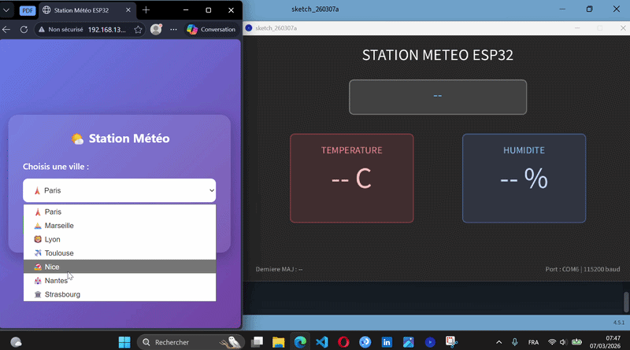

# 🌤️ ESP32 Weather Dashboard


> Système IoT temps réel : Serveur web embarqué + API météo + Visualisation desktop



## 📋 Description

Système d'acquisition de données météo combinant un serveur web ESP32 et une interface de visualisation Processing. Permet de consulter la météo de 7 villes françaises via une interface web responsive et un dashboard desktop temps réel.

## ✨ Fonctionnalités

- ✅ Serveur HTTP embarqué sur ESP32 (port 80)
- ✅ Interface web responsive (mobile-friendly)
- ✅ Récupération API OpenWeatherMap (JSON)
- ✅ Parsing et transmission série (CSV/UART)
- ✅ Dashboard Processing temps réel

## 🛠️ Stack Technique
- **Hardware :** ESP32
- **Backend/Embarqué :** C++ (PlatformIO), HTTPClient, WebServer, ArduinoJson
- **Frontend Web :** HTML/CSS (Généré dynamiquement par l'ESP32)
- **Frontend Desktop :** Java (Processing)

## 📡 Architecture du Système
1. L'utilisateur sélectionne une ville sur la page Web hébergée par l'ESP32.
2. L'ESP32 génère une requête HTTP GET dynamique vers OpenWeatherMap.
3. L'ESP32 désérialise le JSON reçu, actualise la page Web, et envoie un paquet CSV sur le port Série.
4. L'application Processing intercepte le CSV, le parse, et met à jour le tableau de bord.


## 🚀 Installation

### Prérequis
- PlatformIO (VS Code extension)
- Processing 4
- Clé API OpenWeatherMap (gratuite)

## 🎓 Compétences Développées

- Architecture client-serveur
- Intégration d'APIs REST  
- Communication série (UART)
- Parsing JSON
- Design responsive
- Systèmes temps réel

## 📝 License

MIT License - voir [LICENSE](LICENSE)

### ESP32

**1. Clone le repo**
```bash
git clone https://github.com/princemd11y/ESP32-Weather-Dashboard.git
cd ESP32-Weather-Dashboard
```

**2. Ouvre dans VS Code avec PlatformIO**

**3. Configure les paramètres**

Modifie `firmware/src/main.cpp` :
```cpp
const char* ssid = "TON_WIFI";        // Ligne 8
const char* password = "TON_PASSWORD"; // Ligne 9
const char* apiKey = "TA_CLE_API";     // Ligne 10
```

Modifie `firmware/platformio.ini` :
```ini
upload_port = COM6  ; Ligne 16 - Vérifie ton port dans le Gestionnaire de périphériques
```

**4. Upload vers l'ESP32**
```bash
pio run -t upload
```

### Processing

**1. Ouvre le fichier**
```bash
processing/Interface.pde
```

**2. Configure le port série (ligne 15)**
```java
monPort = new Serial(this, "COM6", 115200); // Adapte selon ton système
```

**3. Lance l'application**
Appuie sur **Run** dans Processing

## 📧 Contact
[](https://www.linkedin.com/in/prince-m-142359248/)